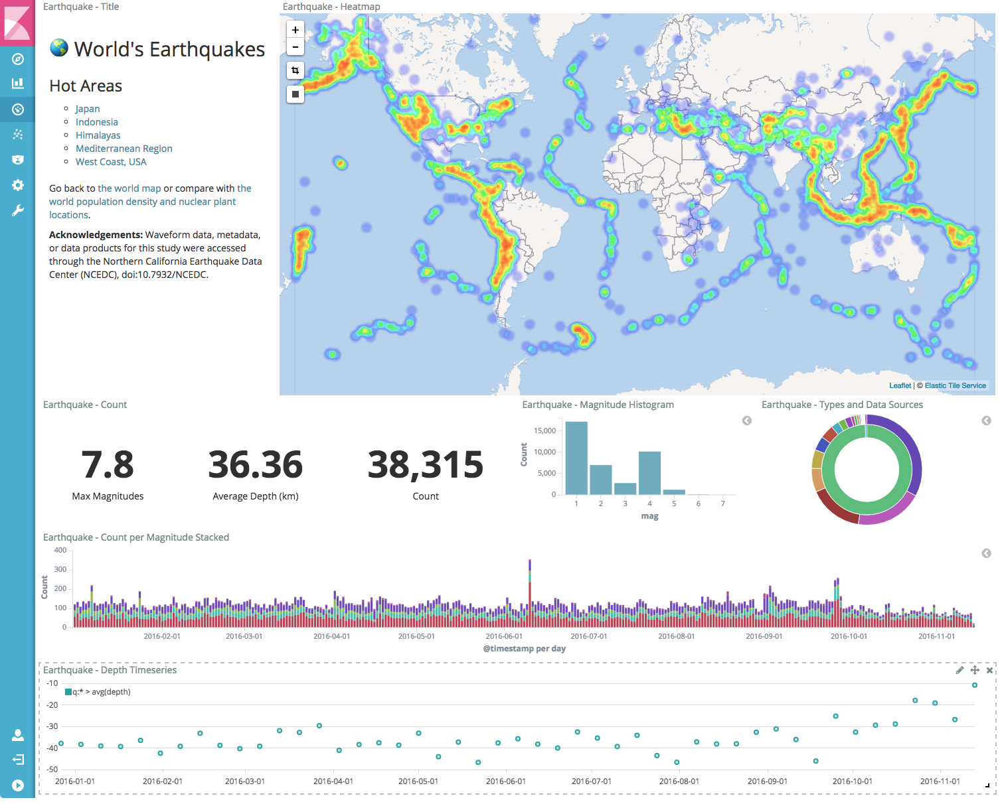
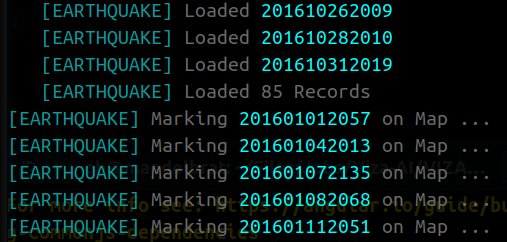
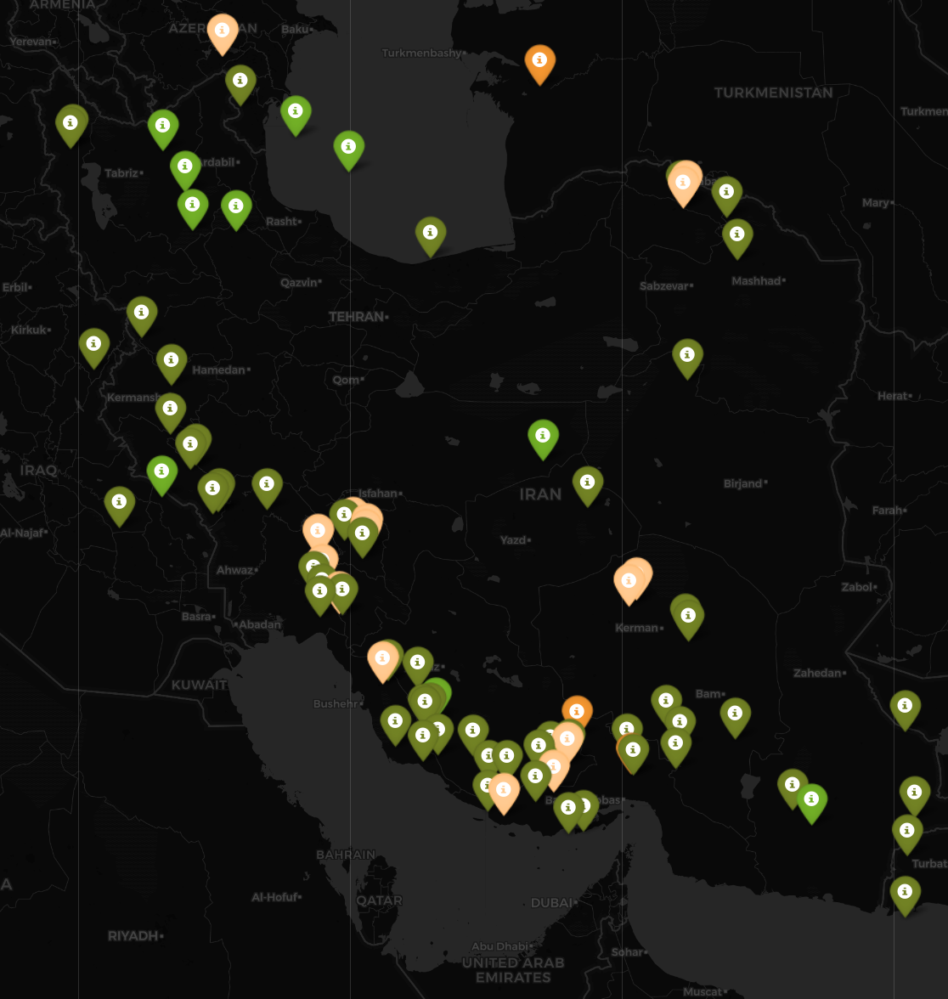
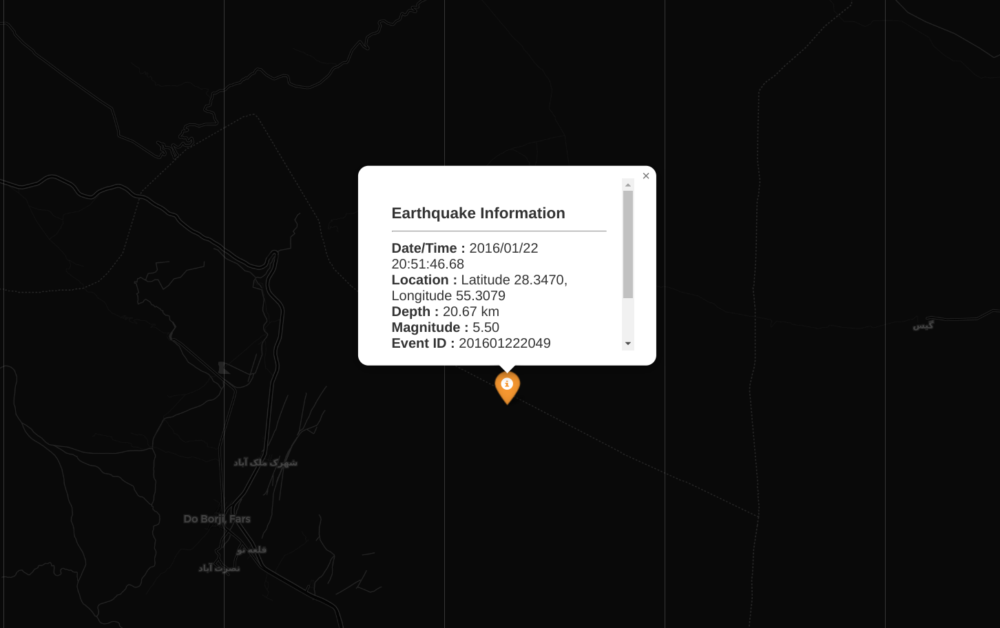
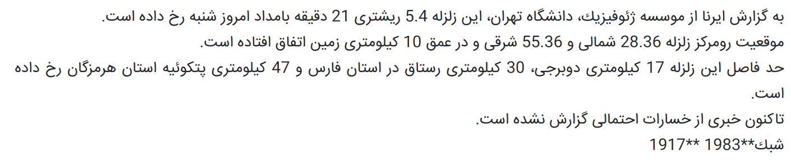

# Analyze-Earthquake-Logs
Shell Script to Use Commands and Methods to Extract or Find Info in Earthquake Log File and Show Results on Map
<p align="center" style="position: relative;">
  
</p>

## Dependencies
* chromium-browser
* Python Library ```folium```

  ```bash
  pip3 install folium
  ```
## Details
First I Extracted Earthquakes Data, then Marking Coordinates on Map via Python Library ```folium``` and Show It in Web Page via ```chromium-browser```
<p align="left" style="position: absolute;">
  
</p>

Total 89 Earthquakes are within Iran's Area Coordinates

## Result Map

<p align="left" style="position: absolute;">
  
</p>

<p align="left" style="position: absolute;">
  
</p>

<p align="left" style="position: absolute;">
  
</p>
